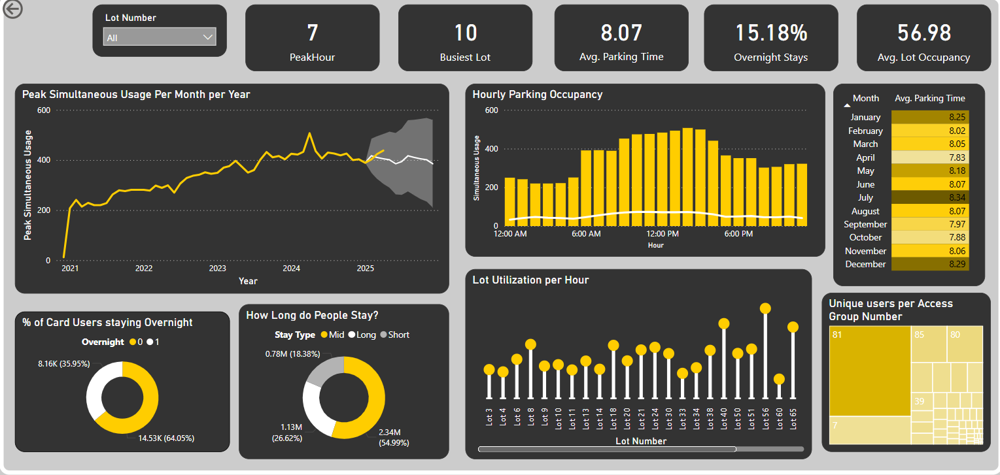

# 🚗 Parking Usage Analytics

[](LICENSE)

## 📖 Overview
This project analyzes **parking lot transaction data** to uncover usage patterns, identify peak hours, and optimize resource allocation.  
It combines **Python-based preprocessing** with **Power BI visualization** to generate actionable insights.

---

## 🎯 Objectives
- Understand overall **parking utilization trends**
- Identify **most frequent peak hours** (not just single-day spikes)
- Calculate **average occupancy** and **median parking duration**
- Present findings in an **interactive Power BI dashboard**

---

## 📊 Power BI Dashboard

Below is a snapshot of the Power BI report generated from the processed parking usage data:



---

## ⚙️ Data Workflow

1. **Raw Data →** `data/raw/`  
   Store unprocessed files such as `CardTransaction.csv`

2. **Preprocessing →** `notebooks/parking_exploration.py`  
   Cleans, fills missing times, and generates processed outputs

3. **Processed Data →** `data/processed/`  
   Includes `cardtransaction_cleaned.csv` and `simultaneous_usage.csv`

4. **Visualization →** `powerbi/dashboard.pbix`  
   Power BI file for interactive visuals

5. **Reports →** `reports/final_report.png`  
   Export of the final Power BI dashboard

---

## 🧠 Data Assumptions

| Scenario | Rule Applied |
|-----------|---------------|
| Missing EntranceTime + ExitTime present | If `Overnight=1`, assume entrance = midnight previous day; else midnight same day |
| Missing ExitTime + EntranceTime present | If `Overnight=1`, assume exit = midnight next day; else 11:59:59 PM same day |
| `EffectiveGroupNumber = -1` | Indicates missing or failed access group mapping |

---

## 🧾 Expected Outputs

| File | Description |
|------|--------------|
| `cardtransaction_cleaned.csv` | Cleaned and standardized transaction log |
| `simultaneous_usage.csv` | Aggregated usage counts for time-based occupancy |
| `final_report.png` | Snapshot of Power BI dashboard |

---

## 🚀 Setup Instructions

```bash
# Clone repo
git clone https://github.com/your-username/parking-usage-analytics.git
cd parking-usage-analytics

# Set up environment
python -m venv .venv
source .venv/bin/activate  # On Windows: .venv\Scripts\activate
pip install -U pip pandas

# Add your raw data
mv CardTransaction.csv data/raw/

# Run preprocessing
python notebooks/parking_exploration.ipynb

# Open Power BI
# Connect to data/processed/ and publish visuals
```
---
## 💡 Future Enhancements

- Add **time-series forecasting** for predicting parking demand  
- Automate **report generation** (PDF or email summary)  
- Connect **Power BI** to a live **SQL backend** for real-time updates  

